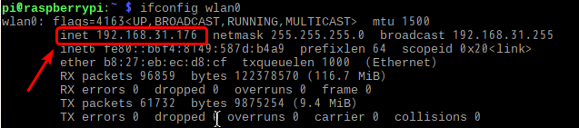
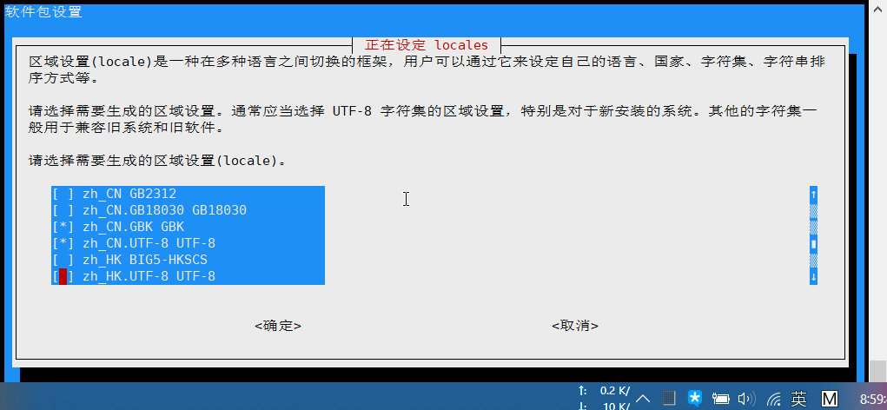
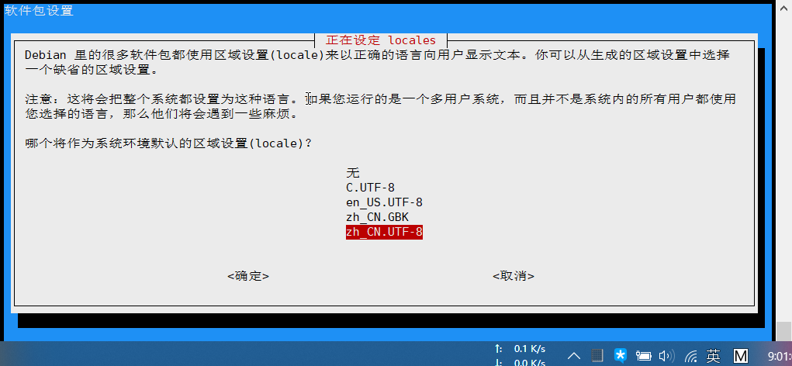
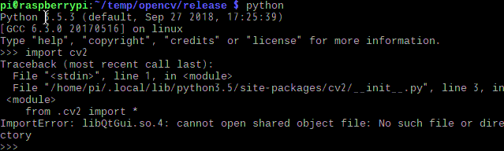
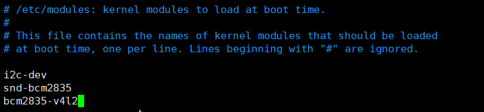

# 树莓派使用

## 初次使用

### 打开 SSH

在boot分区下创建ssh文件，注意不要有后缀名。 

### 设置固定 IP

在cmdline.txt开头添加 `ip=192.168.31.176`，ip地址添加的必须是可用的。

> ip=192.168.31.176 dwc_otg.lpm_enable=0 console=serial0,115200 console=tty1 root=PARTUUID=bb0ac2df-02 rootfstype=ext4 elevator=deadline fsck.repair=yes rootwait quiet splash plymouth.ignore-serial-consoles 

### 设置开机自动连接 WiFi

用户可以在未启动树莓派的状态下单独修改 `/boot/wpa_supplicant.conf` 文件配置 WiFi 的 SSID 和密码，这样树莓派启动后会自行读取 wpa_supplicant.conf 配置文件连接 WiFi 设备。

操作方法简单：将刷好 Raspbian 系统的 SD 卡用电脑读取。在 boot 分区，也就是树莓派的 `/boot` 目录下新建 wpa_supplicant.conf 文件，按照下面的参考格式填入内容并保存 wpa_supplicant.conf 文件。

> country=CN
> ctrl_interface=DIR=/var/run/wpa_supplicant GROUP=netdev
> update_config=1
>
> network={
> ssid="WiFi-A"
> psk="12345678"
> key_mgmt=WPA-PSK
> priority=1
> }
>
> network={
> ssid="WiFi-B"
> psk="12345678"
> key_mgmt=WPA-PSK
> priority=2
> scan_ssid=1
> }

说明以及不同安全性的 WiFi 配置示例：
```proper
ssid:网络的ssid
psk:密码
priority:连接优先级，数字越大优先级越高（不可以是负数）
scan_ssid:连接隐藏WiFi时需要指定该值为1
```

如果你的 WiFi 没有密码

> network={
>
> ssid="你的无线网络名称（ssid）"
>
> key_mgmt=NONE
>
> }

如果你的 WiFi 使用WEP加密

> network={
> ssid="你的无线网络名称（ssid）"
> key_mgmt=NONE
> wep_key0="你的wifi密码"
> }

如果你的 WiFi 使用WPA/WPA2加密

> network={
> ssid="你的无线网络名称（ssid）"
> key_mgmt=WPA-PSK
> psk="你的wifi密码"
> }

如果你不清楚 WiFi 的加密模式，可以在安卓手机上用 root explorer 打开 `/data/misc/wifi/wpa/wpa_supplicant.conf`，查看 WiFi 的信息。

### 连接pi

**登录**

初次使用，使用pi登陆，默认密码是“raspberry”

输入`passwd pi`更改密码

**通过wifi连接**

查看ip地址，红框就是ip地址

```shell
ifconfig wlan0
```



### 支持中文

安装中文字体

```shell
sudo apt-get install ttf-wqy-zenhei
```

刷新字库缓存

```shell
sudo fc-cache
```

安装中文输入法

```shell
sudo apt-get install scim-pinyin
```

配置

输入“`sudo` `raspi-config` ”，然后依次选择Localisation Options -> change_locale -> Default locale for the system environment

用空格选择 “en_US.UTF-8 UTF-8”“zh_CN.UTF-8 UTF-8”“zh_CN.GBK GBK”  ，给它们打上“*”号。



选择完后，按enter键，下一屏选择“zh_CN.UTF-8”



### 解锁root账户登录

安装环默认主机名是 raspberrypi 默认用户是 pi 密码为 raspberry

为了方便折腾，建议第一时间启用 ROOT 账号吧，这个也很简单的，只需要执行一下两句命令即可：

```shell
// 重新开启root账号，可由pi用户登录后，执行此命令后系统会提示输入两遍的root密码，输入你想设的密码即可。
sudo passwd root
sudo passwd --unlock root
```

新版本ssh默认关闭root登陆 你可以修改一下ssh的配置文件

```shell
sudo nano /etc/ssh/sshd_config
```

Ctrl + W 快捷键 搜索 PermitRootLogin without-password

修改 PermitRootLogin without-password 为 PermitRootLogin yes

Ctrl + O 快捷键 保存

Ctrl + X快捷键 退出 Nano 编辑器

执行完之后，用 reboot 命令重启，这样就可以解锁root账户。

### 修改软件源

查看树莓派的版本：

```shell
lsb_release -a
```

> ➜  ~ lsb_release -a
> No LSB modules are available.
> Distributor ID: Raspbian
> Description:    Raspbian GNU/Linux 9.4 (buster)
> Release:        9.4
> Codename:       buster

修改`source.list`

根据版本修改相应的源
上面的输出说明源为`buster`，查找到相应的源，进行替换。
替换源的文件一般在`/etc/apt/`文件夹下。
修改`source.list`

文件的默认的内容为

> deb http://raspbian.raspberrypi.org/raspbian/ buster main contrib non-free rpi
>
> Uncomment line below then 'apt-get update' to enable 'apt-get source'
>
> `#deb-src` http://raspbian.raspberrypi.org/raspbian/ buster main contrib non-free rpi

将上面的源注释掉，添加下面的

> deb http://mirrors.ustc.edu.cn/raspbian/raspbian/ buster  main contrib non-free rpi

修改`raspi.list`文件

还需要修改`/etc/apt/sources.list.d`文件夹下的`raspi.list`，将文件原来的注释掉，添加下面的内容

> deb http://mirrors.ustc.edu.cn/archive.raspberrypi.org/ bustermain ui


### 安装pip3

**1、安装pip**

```
sudo apt-get install python-pip
```

如果未安装python3.6，将机子的默认python改为python3.5的话，再安装pip，当使用pip安装库的时候，可能会出现下面这个错误：

> Traceback (most recent call last):
>   File "/usr/bin/pip", line 9, in <module>
>     from pip import main
> ImportError: No module named 'pip'

使用下面命令应该可以解决：

但是解决后，又将默认的python由3.5换成2.7

```shell
sudo apt-get clean
sudo apt-get update
sudo apt-get install --reinstall python-minimal python-lockfile
```

**2、安装pip3**

1、安装setuptools 

```shell
wget --no-check-certificate https://pypi.python.org/packages/source/s/setuptools/setuptools-19.6.tar.gz
tar -zxvf setuptools-19.6.tar.gz
cd setuptools-19.6/
sudo python3 setup.py build
sudo python3 setup.py install
```

2、安装pip3

```shell
wget --no-check-certificate https://pypi.python.org/packages/source/p/pip/pip-8.0.2.tar.gz
tar -zxvf pip-8.0.2.tar.gz
cd pip-8.0.2/
sudo python3 setup.py build
sudo python3 setup.py install
```

**3、更换pip源，提高下载速度**（对于pi可能没用）

pip国内的一些镜像

阿里云 <http://mirrors.aliyun.com/pypi/simple/> 
中国科技大学 <https://pypi.mirrors.ustc.edu.cn/simple/> 
豆瓣(douban) <http://pypi.douban.com/simple/> 
清华大学 <https://pypi.tuna.tsinghua.edu.cn/simple/> 
中国科学技术大学 <http://pypi.mirrors.ustc.edu.cn/simple/

在pi(登录名)下创建.pip文件夹，在PC上创建pip.conf文件，内容为：

> [global]
> index-url = http://pypi.douban.com/simple
> [install]
> trusted-host = pypi.douban.com

然后将它复制到.pip文件夹下

### 安装python3.6.8

**1、安装python依赖环境** 

```shell
sudo apt-get install build-essential libsqlite3-dev sqlite3 bzip2 libbz2-dev
```

**2、下载python3.6版本源码并解压**

下载可能很慢，可以用PC在python官网（[3.6.8](https://www.python.org/downloads/release/python-368/)）下载好后传到pi中

```shell
wget https://www.python.org/ftp/python/3.6.8/Python-3.6.8.tgz
tar zxvf Python-3.6.8.tgz
```

**3、编译安装，时间较长**

一定要加上`--enable-optimizations`,否则后续用pip安装库的时候会报错。

```shell
cd Python-3.6.8
sudo ./configure --enable-optimizations
sudo make
sudo make install
```

**4、检查安装，出现类似下面时间**

```shell
ls -al /usr/local/bin/python*
```

> lrwxrwxrwx 1 root staff       9 May 15 14:53 /usr/local/bin/python3 -> python3.6
> -rwxr-xr-x 2 root staff 9840168 May 15 14:51 /usr/local/bin/python3.6
> lrwxrwxrwx 1 root staff      17 May 15 14:53 /usr/local/bin/python3.6-config -> python3.6m-config
> -rwxr-xr-x 2 root staff 9840168 May 15 14:51 /usr/local/bin/python3.6m
> -rwxr-xr-x 1 root staff    3103 May 15 14:53 /usr/local/bin/python3.6m-config
> lrwxrwxrwx 1 root staff      16 May 15 14:53 /usr/local/bin/python3-config -> python3.6-config

**5、将python默认版本设置成py3.6.8**

先移除原来的python命令的链接

```shell
sudo rm /usr/bin/python
```

**6、再创建新的链接指向3.6.8的安装位置**

```shell
sudo ln -s /usr/local/bin/python3 /usr/bin/python
```

**7、检查版本**

```sell
python --version
```

> Python 3.6.8

### 安装OpenCV-python

**安装OpenCV所需工具**

```shell
sudo apt-get install build-essential cmake git pkg-config
```

**安装OpenCV的图像工具包** 

```shell
sudo apt-get update
sudo apt-get install libjpeg8-dev 
sudo apt-get install libtiff5-dev 
sudo apt-get install libjasper-dev 
sudo apt-get install libpng12-dev 
```

**安装视频I/O包** 

```shell
sudo apt-get install libavcodec-dev libavformat-dev libswscale-dev libv4l-dev
```

**安装gtk2.0和优化函数包** 

```shell
sudo apt-get install libgtk2.0-dev
sudo apt-get install libatlas-base-dev gfortran
```

**下载OpenCV源码**

```shell
git clone https://github.com/opencv/opencv.git
```

**安装OpenCV**

```shell
cd opencv-3.2.0	# 根据下载的版本而定
mkdir release # 创建release文件夹
cd release # 进入release目录下
# cmake读入所有源文件之后，自动生成makefile
cmakesudo cmake -D CMAKE_BUILD_TYPE=RELEASE \
-D CMAKE_INSTALL_PREFIX=/usr/local \
-D INSTALL_PYTHON_EXAMPLES=ON \
-D BUILD_EXAMPLES=ON ..
sudo make # 编译，非常费时间，我大概花了5个半小时
sudo make install # 安装
sudo ldconfig # 更新动态链接库
```

> CMAKE_BUILD_TYPE是编译方式
>
> CMAKE_INSTALL_PREFIX是安装目录
>
> INSTALL_PYTHON_EXAMPLES是安装官方python例程
>
> BUILD_EXAMPLES是编译例程（这两个可以不加，不加编译稍微快一点点，想要C语言的例程的话，在最后一行前加参数INSTALL_C_EXAMPLES=ON \）
>  之后开始正式编译过程（如果之前一步因为网络问题导致cmake下载缺失文件失败的话，将release文件夹删除掉，重新创建release文件夹并cmake）

**测试代码**

```python
# -*- coding: utf-8 -*-
import cv2

cap = cv2.VideoCapture(0)                                        # 打开摄像头
print("VideoCapture is opened?", cap.isOpened())

while(True):

    ret, frame = cap.read()                                      # 读取摄像头图像
    center = (frame.shape[1]//2, frame.shape[0]//2)              # 图像中心点位置

    gray = cv2.cvtColor(frame, cv2.COLOR_BGR2GRAY)               # 转灰度
    cv2.circle(gray, center=center, radius=100, color=(0,0,255)) # 画圆
    cv2.imshow("frame", gray)                                    # 显示图片

    if cv2.waitKey(1) & 0xFF == ord('q'):
        break

cap.release()            # 释放摄像头
cv2.destroyAllWindows()  # 关闭所有窗口

```

**出现的问题**

1、缺少libQtGui.so

```python
from .cv2 import *
ImportError: libQtGui.so.4: cannot open shared object file: No such file or directory
```



解决：

```shell
sudo apt-get update
sudo apt install libqtgui4
```

2、缺少libQTTest.so

```python
from .cv2 import *
ImportError: libQtTest.so.4: cannot open shared object file: No such file or directory
```

解决：

```shell
sudo apt install libqt4-test
```

3、缺少libhdf5

```python
from .cv2 import *
    ImportError: libhdf5_serial.so.100: cannot open shared object file: No such file or directory
```

解决：

```shell
sudo apt-get install libhdf5-dev libhdf5-serial-dev
```

4、无法打开摄像头

```shell
python opencv_test.py
VIDEOIO ERROR: V4L: can't open camera by index 0
VideoCapture is opened? False
Traceback (most recent call last):
  File "opencv_test.py", line 11, in <module>
    center = (frame.shape[1]//2, frame.shape[0]//2)              # 图像中心点位置
AttributeError: 'NoneType' object has no attribute 'shape'

```

解决：

```shell
sudo vim /etc/modules
```

进入编辑界面在末尾添加输入 

snd-bcm2835

bcm2835-v4l2 



## GPIO

GPIO引脚 x 26    UART总线 x 1	  SPI总线 x 1	I2C总线 x 1	5V x 2		3.3V x 2	GND x 8

40pin引脚图

 

 

### GPIO使用基础

http://shumeipai.nxez.com/2016/09/28/rpi-gpio-module-basics.html

